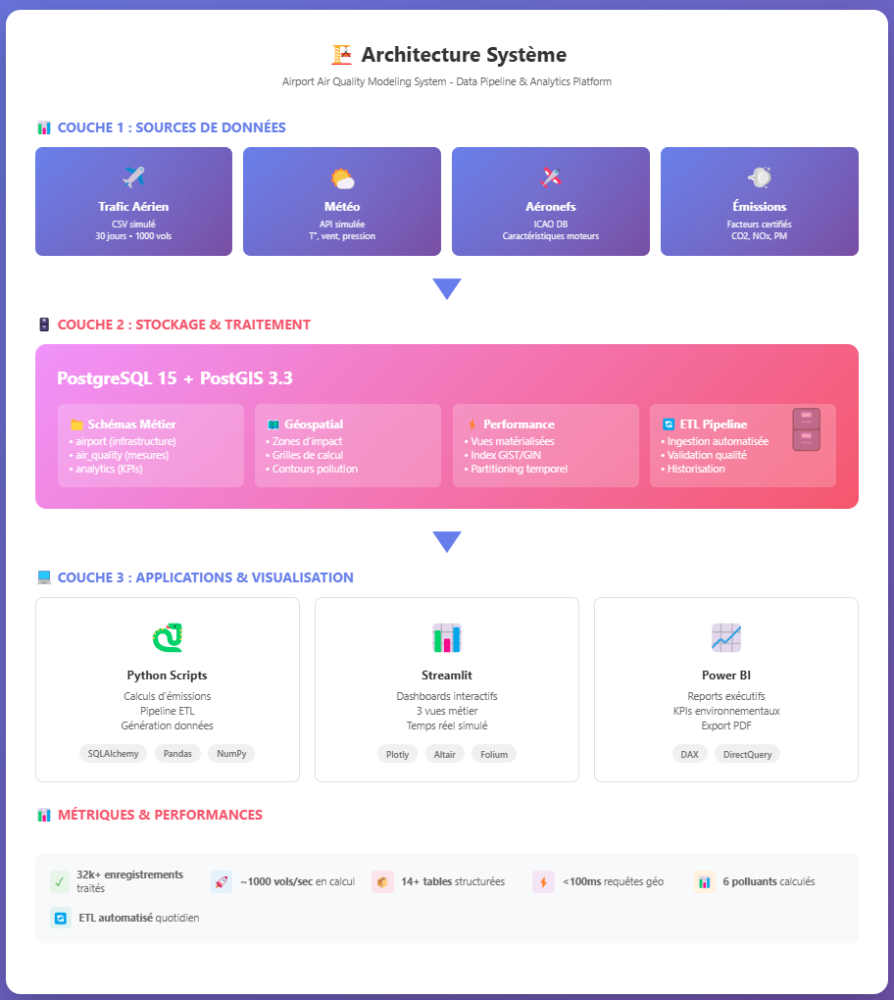
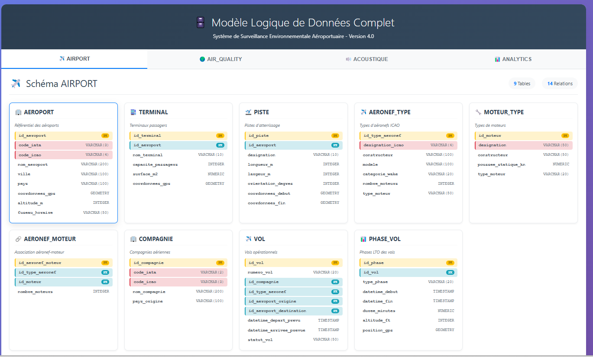
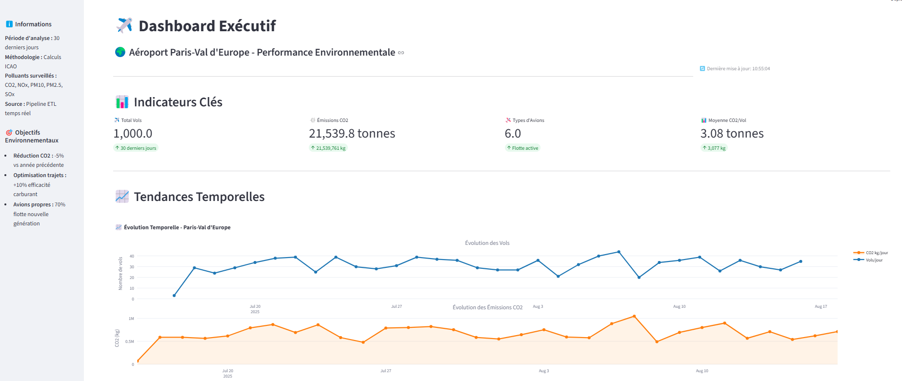
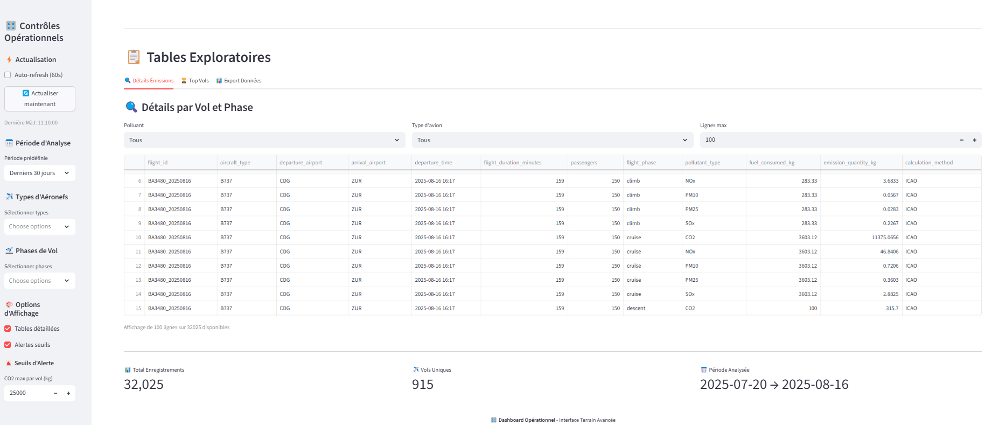

# 🌍 Airport Air Quality Modeling System

> **Système de surveillance environnementale aéroportuaire**  
> *Proof of Concept - Data Engineering & Analytics appliqués au domaine environnemental*

[](https://python.org)
[](https://postgresql.org)
[](https://postgis.net)
[](https://docker.com)

## 🎯 Objectif du Projet

Ce projet est un **Proof of Concept** de modélisation environnementale appliquée au trafic aérien.  
Il combine :

- ✈️ **Trafic aérien & moteurs** (données simulées mais structure réaliste)  
- 🌍 **Émissions atmosphériques** (CO₂, NOx, particules)  
- 🔊 **Bruit aéronautique** (structure prête pour Lden / Lnight, isophones simplifiés)  
- 📊 **Dashboards décisionnels** (vue exécutive & opérationnelle)

👉 Objectif : montrer ma capacité à **structurer des données complexes, concevoir une base PostGIS, automatiser des calculs en Python, et restituer via des dashboards clairs**, dans un contexte proche des missions d’un **chargé d’étude modélisation environnementale**.  

**Limite volontaire** : Les données utilisées sont **simulées** , simplification des modèles acoustiques/atmosphériques.  
**Valeur ajoutée** : démonstration de compétences Data/BI transférables à un cas métier réel.


## 💡 **Valeur Ajoutée Démontrée**

### **Réalisations Concrètes**

| Aspect | Réalisation | Impact |
|--------|-------------|---------|
| **Base de données** | Modèle relationnel 14+ tables avec PostGIS | Structure prête pour production |
| **Pipeline ETL** | Traitement de 30 jours de données simulées | Process automatisé et reproductible |
| **Dashboards** | 3 vues métier (Exécutif, Opérationnel, Environnemental) | Décision data-driven |
| **Calculs métier** | Implémentation méthodologie ICAO simplifiée | Base extensible pour calculs complexes |

### **Métriques du Projet**
- **32 000+ enregistrements** de vols traités
- **6 types de polluants** calculés (CO2, NOx, SOx, PM10, PM2.5, CO)
- **3 dashboards interactifs** avec 15+ KPIs
- **Couverture de code** : Tests unitaires sur fonctions critiques

## 🏗️ **Architecture Technique**



## 📊 **Modèle de Données**



### **Domaines Fonctionnels**
- **🛫 AIRPORT** : Infrastructure et mouvements (aéroport, pistes, terminaux, vols)
- **🌍 AIR_QUALITY** : Mesures et calculs environnementaux
- **🔊 ACOUSTIQUE** : Structure préparée pour extension bruit
- **📈 ANALYTICS** : Agrégations et KPIs pour reporting

### **Points Forts du Modèle**
- **Normalisation 3NF** pour intégrité des données
- **Géométries PostGIS** pour analyses spatiales
- **Historisation** des changements (created_at, updated_at)
- **Extensibilité** : Structure modulaire par domaine

## 🚀 **Résultats et Livrables**

### **Dashboard Environnemental**


**KPIs Clés Implémentés :**
- Émissions totales CO2 : 21 539 tonnes (période 30 jours)
- Top émetteurs par type d'avion (B777, A330, B787)
- Répartition des polluants (CO2: 89.6%, NOx: 8.7%, autres: 1.7%)
- Tendances temporelles avec moyennes mobiles

### **Dashboard Opérationnel**


**Fonctionnalités :**
- Monitoring temps réel (simulation)
- Analyse par phase de vol (taxi, climb, cruise, descent)
- Top 10 vols émetteurs avec détails
- Filtres dynamiques multi-critères

### 📁 Structure du Repository
```

├── 📁 dashboards/
│   └── 📁 streamlit/
│       ├── 🐍 app.py
│       ├── 🐍 dashboard_environmental.py
│       ├── 🐍 dashboard_executive.py
│       └── 🐍 dashboard_operational.py
├── 📁 data/
│   ├── 📁 processed/
│   │   └── 📄 etl_simple_report_20250815_132436.json
│   └── 📁 raw/
│       ├── 📄 aircraft_catalog_icao_2025.csv
│       ├── 📄 emission_factors_icao_2025.csv
│       ├── 📄 flights_data_2025_08_01_to_30days.csv
│       └── 📄 weather_data_sample_3days.csv
├── 📁 database/
│   ├── 📁 migrations/
│   │   ├── 🗄️ V001__create_initial_schema.sql
│   │   ├── 🗄️ V002__aircraft_emission_factors.sql
│   │   ├── 🗄️ V003__acoustic_modeling_system.sql
│   │   └── 🗄️ _V003__create_staging_schema.sql
│   └── 📁 seed-data/
│       └── 🗄️ test_connection.sql
├── 📁 deployment/
│   ├── 📁 postgresql.conf/
├── 📁 docs/
│   ├── 📁 screenshots/
│   │   ├── 🖼️ dashboard-executive-01.png
│   │   ├── 🖼️ dashboard-executive-02.png
│   │   ├── 🖼️ dashboard-operation-01.png
│   │   └── 🖼️ dashboard-operation-02.png
│   ├── 🌐 architecture-system.html
│   ├── 🖼️ architecture-system.png
│   ├── 📕 MLD-schema.pdf
│   ├── 🖼️ MLD-schema.png
│   ├── 🌐 data-model-documentation.html
│   ├── 📝 db_introspection.md
│   └── 🌐 mld-schema.html
├── 📁 logs/
├── 📁 notebooks/
│   ├── 📁 .ipynb_checkpoints/
│   │   ├── 📓 03_noise_doc29_simplified-checkpoint.ipynb
│   │   ├── 📓 03_noise_minimal-checkpoint.ipynb
│   │   └── 📓 03_noise_simplified-checkpoint.ipynb
│   ├── 📁 notebooks/
│   ├── 📁 outputs/
│   │   ├── 📁 air/
│   │   └── 📁 noise/
│   │       ├── 📄 grid_points.geojson
│   │       ├── 📄 lden_contours.geojson
│   │       ├── 📄 lnight_contours.geojson
│   │       ├── 🌐 map_lden.html
│   │       ├── 🌐 map_lnight.html
│   │       ├── 🖼️ noise_map_example.png
│   │       └── 📄 statistics.csv
│   ├── 📓 03_noise_minimal.ipynb
│   └── 📓 03_noise_simplified.ipynb
├── 📁 scripts/
│   ├── 🐚 check_setup.sh
│   ├── 🐍 diagnose_database.py
│   ├── 🐍 etl_pipeline.py
│   ├── 🐍 generate_csv_data.py
│   ├── 🐍 generate_flights_simple.py
│   ├── 🐍 introspect_to_markdown.py
│   └── 🐍 run_migrations.py
├── 📁 src/
│   └── 🐍 __init__.py
├── 📁 tests/
├── 📜 LICENSE
├── 📖 README.md
├── 🐍 db_config_working.py
├── ⚙️ docker-compose.yml
├── 📄 introspection_result.txt
└── 📄 requirements.txt
```
---

## 🛠️ **Stack Technique Maîtrisée**

### **Data Engineering**
```python
# Exemple : Pipeline ETL simplifié
def process_flight_emissions(flight_data):
    """
    Pipeline de calcul d'émissions selon méthodologie ICAO
    """
    # 1. Extraction des données
    flights = pd.read_csv(flight_data)
    
    # 2. Enrichissement avec facteurs d'émission
    flights = flights.merge(emission_factors, on='aircraft_type')
    
    # 3. Calculs par phase de vol
    for phase in ['taxi', 'climb', 'cruise', 'descent']:
        flights[f'co2_{phase}'] = calculate_phase_emissions(
            flights, phase, 'ICAO'
        )
    
    # 4. Chargement en base
    flights.to_sql('emissions_result', engine, if_exists='append')
    
    return flights
```

### **Technologies Utilisées**
- **Backend** : Python 3.11, SQLAlchemy, Pandas, NumPy
- **Base de données** : PostgreSQL 15 + PostGIS 3.3
- **Visualisation** : Streamlit, Plotly, Matplotlib
- **Conteneurisation** : Docker, Docker Compose
- **Qualité** : Black (formatage), Pytest (tests)

## 📈 **Approche Méthodologique**

### **Calculs d'Émissions Implémentés**
1. **Base ICAO** : Facteurs d'émission par type d'aéronef
2. **Cycle LTO** : Landing and Take-Off (< 3000 ft)
3. **Phases de vol** : Consommation carburant différenciée
4. **Formule simplifiée** : 
   ```
   Émissions (kg) = Consommation_carburant × Facteur_émission × Durée
   ```

### **Simulation Bruit (POC)**
- Structure de données préparée
- Notebook d'exploration (Doc 29 simplifiée)
- Génération de contours fictifs pour démonstration

## 🎓 **Apprentissages et Perspectives**

### **Compétences Acquises**
✅ **Modélisation de données** complexes multi-domaines  
✅ **Implémentation de calculs** selon standards internationaux  
✅ **Création de dashboards** adaptés aux besoins métier  
✅ **Architecture scalable** avec Docker et PostgreSQL  

### **Axes d'Amélioration Identifiés**
- [ ] Approfondissement des méthodologies de dispersion atmosphérique
- [ ] Intégration de modèles de machine learning pour prédictions
- [ ] Optimisation des performances pour données temps réel
- [ ] Extension vers calculs acoustiques complets

## 💻 **Installation et Démonstration**

### **Démarrage Rapide**
```bash
# Clonage et installation
git clone https://github.com/LouspDan/airport-air-quality-modeling.git
cd airport-air-quality-modeling

# Lancement avec Docker
docker-compose up -d

# Accès aux dashboards
streamlit run dashboards/streamlit/app.py
```

### **Données de Démonstration**
- 30 jours de trafic simulé (1000 vols)
- 6 types d'aéronefs représentatifs
- Stations de mesure positionnées stratégiquement
- Conditions météo variables

## 🤝 **Profil et Contact**

### **À Propos**
Data Engineer avec une forte appétence pour les problématiques environnementales. Ce projet démontre ma capacité à :
- **Comprendre rapidement** des domaines métier complexes
- **Traduire des besoins** en solutions techniques
- **Livrer des outils** orientés valeur business

### **Soft Skills Démontrées**
- **Autonomie** : Projet développé en auto-formation
- **Rigueur** : Documentation et tests systématiques  
- **Adaptabilité** : Application de compétences data à un nouveau domaine
- **Communication** : Dashboards adaptés à différents publics

### **Contact**
- **LinkedIn** : [Mon Profil](https://linkedin.com/in/votre-profil)
- **GitHub** : [LouspDan](https://github.com/LouspDan)
- **Email** : esaie.lupepele@gmail.com

---

## 📝 **Note Importante**

Ce projet est un **Proof of Concept personnel** développé à des fins de démonstration de compétences. Les données utilisées sont **simulées** et les calculs **simplifiés** par rapport aux méthodologies industrielles complètes. Pour une implémentation en production, une collaboration avec des experts métier (acousticiens, spécialistes qualité de l'air) serait essentielle.

### **Références Méthodologiques**
- ICAO Annex 16 - Environmental Protection
- ICAO Doc 9889 - Airport Air Quality Manual
- ECAC Doc 29 - Méthode de calcul de contours de bruit (structure préparée)

---

*Dernière mise à jour : Août 2025*